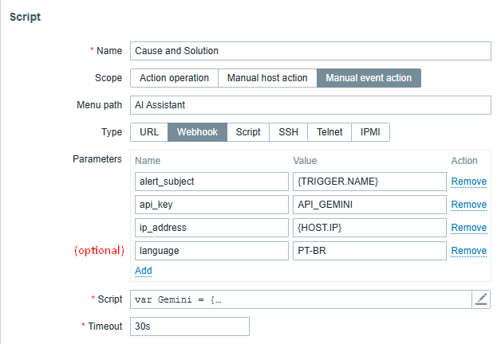
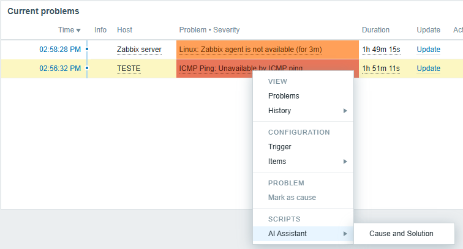

# ScriptIAHelpForZabbix

Este script permite que o Zabbix envie alertas para a API Gemini (Google AI), solicitando sugestões de causas e soluções para incidentes detectados. Ele gera respostas concisas com possíveis causas, comandos de depuração e medidas preventivas.

## 📌 Requisitos

- Zabbix 7.0 ou superior
- Chave de API válida da [API Gemini](https://aistudio.google.com/app/apikey)
- Acesso à internet para chamadas HTTP

## ⚙️ Parâmetros obrigatórios

O script espera os seguintes parâmetros no campo `value` do webhook:

 - `alert_subject`: `{TRIGGER.NAME}`,
 - `ip_address`: `{HOST.IP}`,
 - `api_key`: `SUA_CHAVE_GEMINI`,

## 🔤 Parâmetro opcional

- `language`: Define o idioma da resposta (ex: `"Português"`, `"pt-BR"`, `"Español"`). Se não for definido, o script sugerirá que o usuário forneça esse parâmetro, o default é Inglês.

## 🧠 O que o script faz

1. **Validação**: Verifica se os parâmetros obrigatórios estão presentes e não vazios.
2. **Formatação**: Cria uma mensagem com detalhes do alerta e solicita uma resposta concisa da API Gemini.
3. **Requisição**: Envia a mensagem para a API Gemini e processa a resposta.
4. **Sugestão de idioma**: Se o parâmetro `language` não for fornecido, adiciona uma dica para o usuário incluir esse parâmetro.

## 🛠️ Exemplo de uso no Zabbix

- “Alerts” > “Scripts” > “Create Script”

 - `alert_subject`: `{TRIGGER.NAME}`,
 - `ip_address`: `{HOST.IP}`,
 - `api_key`: `SUA_CHAVE_GEMINI`,
 - `language`: `PT-BR`

- Acesse o painel de alertas e selecione um alerta específico.

## 📝 Exemplo de resposta gerada

> The alert: High CPU Usage, with the IP: 192.168.1.10 occurred in Zabbix.  
> Possible causes:  
> - High load due to intensive processes  
> - Insufficient resources  
> Suggested actions:  
> - Check running processes  
> - Optimize resource usage  
> - Consider hardware upgrades  
